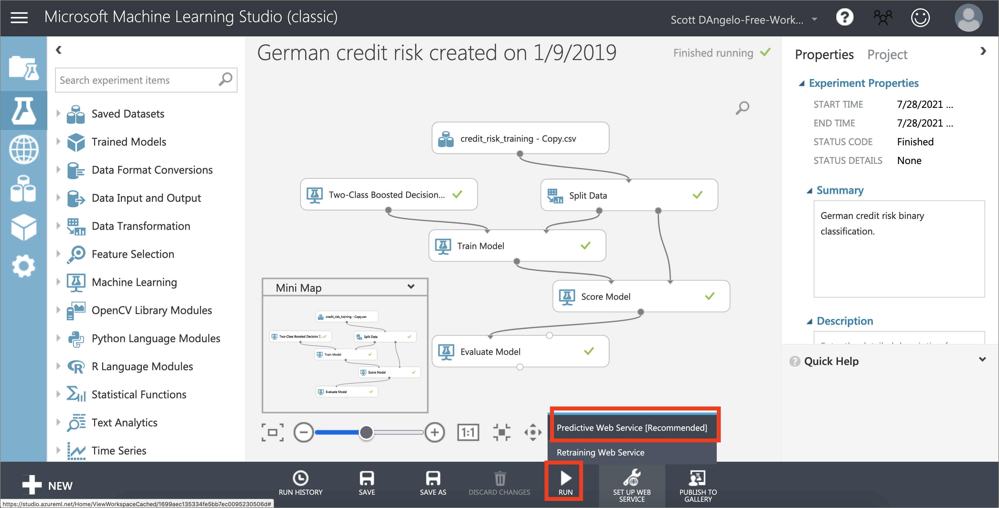

# Monitor Azure ML With Watson OpenScale

In this Code Pattern, we will use a German Credit dataset to create a logistic regression model using Azure Machine Learning Studio. We will use Watson OpenScale to bind the ML model deployed in the Azure cloud, create a subscription, and perform payload and feedback logging.

When the reader has completed this Code Pattern, they will understand how to:

* Prepare data, train a model, and deploy using Azure Machine Learning Studio
* Score the model using sample scoring records and the scoring endpoint
* Setup Watson OpenScale Data Mart
* Bind the Azure model to the Watson OpenScale Data Mart
* Add subscriptions to the Data Mart
* Enable payload logging and performance monitoring for both subscribed assets
* Use Data Mart to access tables data via subscription


## Flow

1. The developer creates a Jupyter Notebook.
2. The Jupyter Notebook is connected to a PostgreSQL database, which is used to store Watson OpenScale data.
3. An ML model is created using Azure ML Studio, using data from [credit_risk_training.csv](https://github.com/IBM/monitor-azure-ml-with-ai-openscale/data/credit_risk_training.csv),  and then it is deployed to the cloud.
4. Watson Open Scale is used by the notebook to log payload and monitor performance.

## Prerequisites

* An [IBM Cloud Account](https://cloud.ibm.com/)
* [IBM Cloud CLI](https://cloud.ibm.com/docs/cli/reference/ibmcloud/download_cli.html#install_use)
* [IBM Cloud Object Storage (COS)](https://www.ibm.com/cloud/object-storage)
* An account on [Azure Machine Learning Studio](https://studio.azureml.net)

# Steps

1. [Clone the repository](#1-clone-the-repository)
1. [Create a Watson OpenScale service](#2-create-a-watson-openscale-service)
1. [Create a Model on Azure Machine Learning Studio](#3-create-a-model-on-azure-machine-learning-studio)
1. [Run the notebook](#4-run-the-notebook)

### 1. Clone the repository

```bash
git clone https://github.com/IBM/monitor-sagemaker-ml-with-ai-openscale
cd monitor-sagemaker-ml-with-ai-openscale
```

### 2. Create a Watson OpenScale service

* Using the [IBM Cloud Dashboard](https://cloud.ibm.com/dashboard/apps) create a [Watson OpenScale](https://cloud.ibm.com/catalog/services/ai-openscale) service.
* You will get the Watson OpenScale instance GUID when you run the notebook using the [IBM Cloud CLI](https://cloud.ibm.com/catalog/services/ai-openscale)

### 3. Create a Model on Azure Machine Learning Studio

> Note: Here we provide minimal instructions. It is beyond the scope of this Code Pattern to provide detailed support for the Azure platform.

* Copy [credit risk experiment](https://gallery.cortanaintelligence.com/Experiment/German-credit-risk-created-on-1-9-2019) from Azure ML Studio Gallery

  

* Run the experiment to train a model.

  


* Create (deploy) web service.

  

### 4. Run the notebook

* Move your cursor to each code cell and run the code in it. Read the comments for each cell to understand what the code is doing. **Important** when the code in a cell is still running, the label to the left changes to **In [\*]**:.
  Do **not** continue to the next cell until the code is finished running.

* Follow the instructions for `ACTION: Get Watson OpenScale instance_guid and apikey` using the [IBM Cloud CLI](https://cloud.ibm.com/docs/cli/index.html#overview)

How to get api key using ibmcloud console:
```bash
ibmcloud login --sso
ibmcloud iam api-key-create 'my_key'
```

* Enter this IBM Cloud API key in the cell for `CLOUD_API_KEY`.

* Leave the `DB_CREDENTIALS` as `None` to use the internal OpenScale database (recommended). Use the commented out fields to create the `DB_CREDENTIALS` if you wish to use an external database.

* In your [IBM Cloud Object Storage](https://www.ibm.com/cloud/object-storage)  instance, create a bucket with a globally unique name. The UI will let you know if there is a naming conflict.

* In your [IBM Cloud Object Storage](https://www.ibm.com/cloud/object-storage) instance, get the Service Credentials for use as `COS_API_KEY_ID`, `COS_RESOURCE_CRN`, and `COS_ENDPOINT`:

  

* Insert you bucket name in the next cell as `BUCKET_NAME`.

How to get your Watson OpenScale instance GUID:
```bash
ibmcloud resource service-instance <WatsonOpenScale_instance_name>
```

* In the cell after `2. Bind machine learning engine` enter the `client_id`, `client_secret`, `subscription_id`, and `tenant` for the `AZURE_ENGINE_CREDENTIALS`.

> NOTE: Setting up Azure Active Directory for the AZURE_ENGINE_CREDENTIALS is beyond the scope of this document. See [Azure documentation](https://docs.microsoft.com/en-us/azure/) for help with this.

* After running the cell above `2.1 Add deployment ID from asset_deployment_details above` you will get a `{'metadata': {'guid': '<deployment_id>'` to use in the cell below as `deployment_id` (without the angle brackets '<' and '>').


# Sample Output

See the [example notebook with output](examples/WatsonOpenScaleAndAzureMLengineExampleOutput.ipynb)

# License

This code pattern is licensed under the Apache License, Version 2. Separate third-party code objects invoked within this code pattern are licensed by their respective providers pursuant to their own separate licenses. Contributions are subject to the [Developer Certificate of Origin, Version 1.1](https://developercertificate.org/) and the [Apache License, Version 2](https://www.apache.org/licenses/LICENSE-2.0.txt).

[Apache License FAQ](https://www.apache.org/foundation/license-faq.html#WhatDoesItMEAN)
